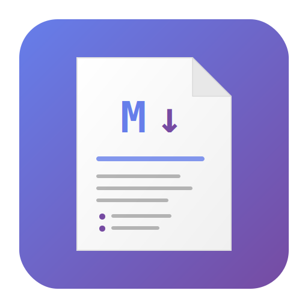

# MD Viewer

<p align="center">
  
</p>

<p align="center">
  <strong>一款跨平台的 Markdown 檢視器與編輯器</strong>
</p>

<p align="center">
  <a href="#功能特色">功能特色</a> ?
  <a href="#下載安裝">下載安裝</a> ?
  <a href="#使用說明">使用說明</a> ?
  <a href="#開發指南">開發指南</a> ?
  <a href="#授權條款">授權條款</a>
</p>

---

## 功能特色

### ?? Markdown 預覽
- 即時渲染 Markdown 為美觀的 HTML 格式
- 支援 GitHub Flavored Markdown (GFM)
- 支援表格、程式碼區塊、數學公式等進階語法

### ?? 多種主題
提供 13 種精選主題，滿足不同閱讀需求：

| 類型 | 主題 |
|------|------|
| **基本** | 淺色、深色 |
| **VS Code 風格** | One Dark Pro、Dracula、Nord、Monokai |
| **Solarized** | Solarized Dark、Solarized Light |
| **GitHub** | GitHub Dark、GitHub Light |
| **護眼** | 護眼綠、暖色米黃 |
| **輔助功能** | 高對比 |

### ?? 編輯功能
- 左右分割視圖：左側編輯原始碼，右側即時預覽
- 語法高亮顯示
- 自動儲存提示

### ?? 匯出功能
- **PDF** - 支援 A4/Letter/Legal 紙張大小，可加入頁碼
- **HTML** - 完整樣式的獨立 HTML 檔案

### ?? 檔案瀏覽
- 內建檔案樹狀瀏覽器
- 支援所有本機磁碟
- 快速展開/收合資料夾

---

## 下載安裝

### Windows

從 [Releases](https://github.com/sjvann/MD_Viewer/releases) 頁面下載最新版本：

| 檔案 | 說明 |
|------|------|
| `MD_Viewer-win-x64.zip` | Windows 64 位元版本 |
| `MD_Viewer-win-x64-selfcontained.zip` | 獨立版本（不需安裝 .NET） |

#### 系統需求
- Windows 10 版本 1903 (19041) 或更新版本
- .NET 10 Runtime（如使用非獨立版本）

### 其他平台
- **Android** - 開發中
- **iOS** - 開發中
- **macOS** - 開發中

---

## 使用說明

### 基本操作

1. **開啟檔案**
   - 從左側檔案樹選擇磁碟
   - 展開資料夾，點擊 `.md` 檔案

2. **切換主題**
   - 點擊右上角「主題」下拉選單
   - 選擇喜歡的配色方案

3. **編輯模式**
   - 點擊「編輯」按鈕進入編輯模式
   - 左側編輯 Markdown，右側即時預覽
   - 點擊「儲存」保存變更

4. **匯出文件**
   - 點擊「匯出 PDF」或「匯出 HTML」
   - 選擇儲存位置

### 快速鍵

| 快速鍵 | 功能 |
|--------|------|
| 待實作 | - |

---

## 螢幕截圖

### 預覽模式


### 編輯模式


### 主題選擇


---

## 開發指南

### 環境需求

- Visual Studio 2022 17.10 或更新版本
- .NET 10 SDK
- Windows 10 SDK (10.0.19041.0)

### 建置專案

```bash
# Clone 專案
git clone https://github.com/sjvann/MD_Viewer.git
cd MD_Viewer

# 還原套件
dotnet restore

# 建置
dotnet build

# 執行
dotnet run --project MD_Viewer
```

### 專案結構

```
MD_Viewer/
├── MD_Viewer/                 # 主要 MAUI 應用程式
│   ├── Platforms/            # 平台特定實作
│   │   ├── Windows/          # Windows 平台
│   │   ├── Android/          # Android 平台
│   │   ├── iOS/              # iOS 平台
│   │   └── MacCatalyst/      # Mac 平台
│   ├── Services/             # 服務層
│   ├── ViewModels/           # MVVM ViewModels
│   ├── Views/                # UI 視圖元件
│   └── MainPage.xaml         # 主頁面
├── MD_Viewer.Shared/         # 共用模型和介面
│   ├── Models/               # 資料模型
│   └── ViewModels/           # ViewModel 介面
├── MD_Viewer.Blazor/         # Blazor 元件（備用）
└── README.md
```

### 技術架構

| 技術 | 用途 |
|------|------|
| .NET MAUI | 跨平台 UI 框架 |
| CommunityToolkit.Mvvm | MVVM 模式實作 |
| CommunityToolkit.Maui | MAUI 擴充功能 |
| Markdig | Markdown 解析器 |
| QuestPDF | PDF 生成 |
| WebView | HTML 預覽渲染 |

### 多平台支援

目前專案設定為 Windows-only。若要啟用其他平台，修改 `MD_Viewer.csproj`：

```xml
<!-- 取消註解以啟用多平台 -->
<TargetFrameworks>net10.0-android;net10.0-ios;net10.0-maccatalyst;net10.0-windows10.0.19041.0</TargetFrameworks>
```

---

## 貢獻指南

歡迎提交 Issue 和 Pull Request！

1. Fork 此專案
2. 建立功能分支 (`git checkout -b feature/AmazingFeature`)
3. 提交變更 (`git commit -m 'Add some AmazingFeature'`)
4. 推送到分支 (`git push origin feature/AmazingFeature`)
5. 開啟 Pull Request

---

## 授權條款

本專案採用 MIT 授權條款 - 詳見 [LICENSE](LICENSE) 檔案。

---

## 致謝

- [Markdig](https://github.com/xoofx/markdig) - Markdown 解析器
- [QuestPDF](https://github.com/QuestPDF/QuestPDF) - PDF 生成庫
- [VS Theme Pack](https://marketplace.visualstudio.com/items?itemName=idex.vsthemepack) - 主題配色靈感

---

<p align="center">
  Made with ?? by <a href="https://github.com/sjvann">sjvann</a>
</p>
